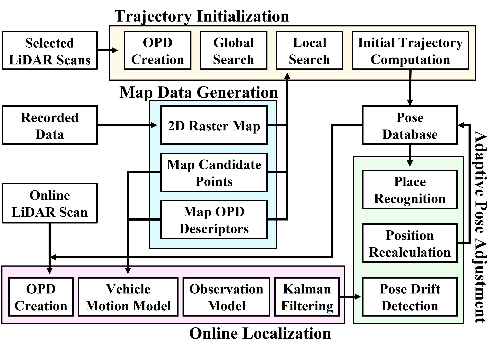
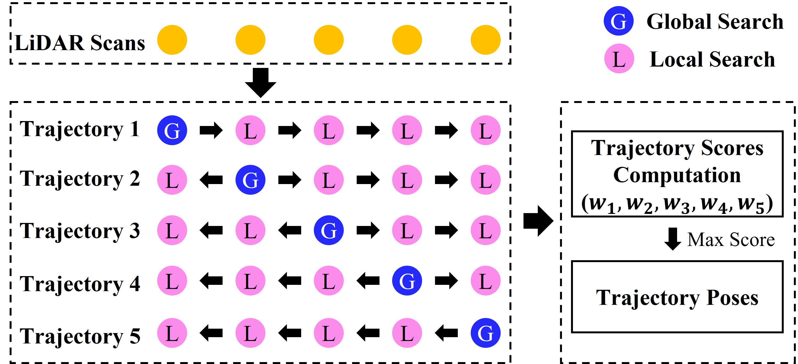
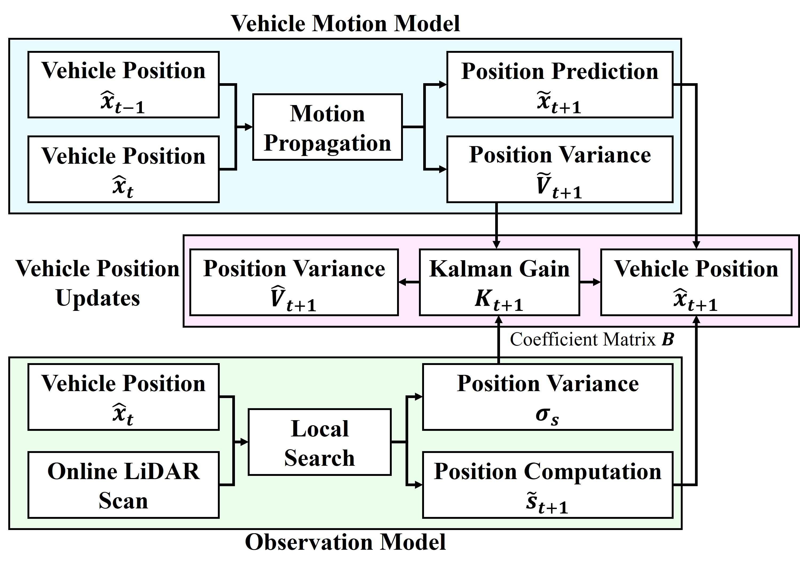
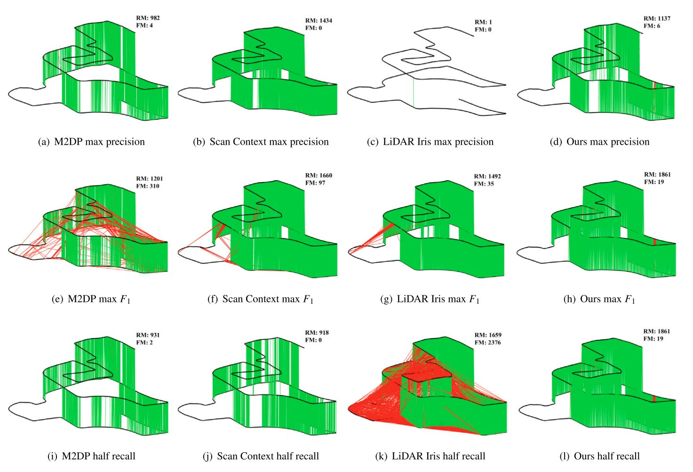
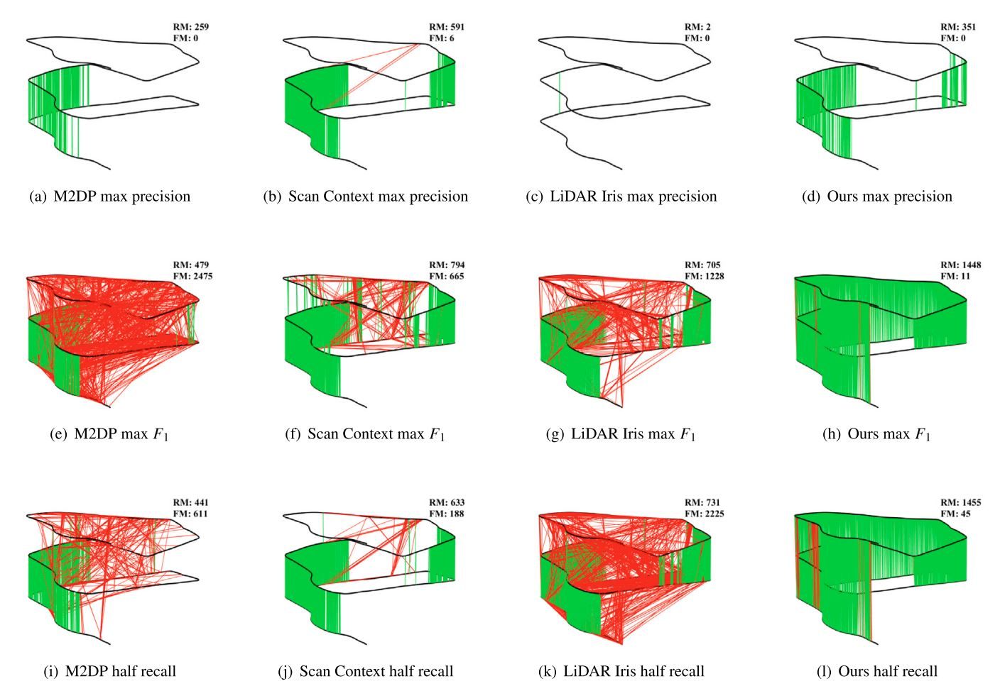

<h1 align="center">A Fast LiDAR Place Recognition and Localization Method by Fusing Local and Global Search</h1>

<!-- Developer: [**Pengcheng Shi**](https://github.com/ShiPC-AI) -->

**Occupied-Place-Description**, also referred to as **LiDAR-OnLoc**, is an online LiDAR localization solution that leverages a point cloud map and sequential LiDAR scans. This packsge employs a point cloud map and sequential LiDAR scans as input to compute a 3-DOF global pose, enabling both global **pose estimation** and **place recognition**. This package consists of four modules. The map data generation stitches a point cloud map using offline recorded data and builds a hybrid map database including candidate points and map descriptors. The trajectory initialization selects a few scans from the beginning of the sequence to calculate the vehicle’s poses and initialize the trajectory. After obtaining the initial trajectory, the online localization calculates the vehicle’s poses based on a single online LiDAR scan. The adaptive pose adjustment exploits the displacement error and matching score to correct the false localization and detect revisited places. 

<figure align="center">
    
    <figcaption><strong>Overall Framework</strong></figcaption>
</figure>


|  Trajectory Initialization         |       Online Localization          |
|:----------------------------------:|:----------------------------------:|
|||

> **Note:** The current version uses both the KD tree and hash tables.
---
### Demo
1. **KITTI 06**

|  Offline Mapping                   |   Online Localization              |
|:----------------------------------:|:----------------------------------:|
|         |    |

2. **MulRan DCC01**

|            Offline Mapping         |   Online Localization              |
|:----------------------------------:|:----------------------------------:|
|         |      |

> **Note:** In the right demo, the red lines represent the initial trajectory.

### Citation
- **LiDAR-OnLoc** has been accepted for ***ISPR P&RS***: [Published Paper](https://www.sciencedirect.com/science/article/pii/S0924271623001892).
- If you use code or data of **LiDAR-OnLoc** in your academic research, please cite our paper:
```
@article{shi2023fast,
  title={A fast LiDAR place recognition and localization method by fusing local and global search},
  author={Shi, Pengcheng and Li, Jiayuan and Zhang, Yongjun},
  journal={ISPRS Journal of Photogrammetry and Remote Sensing},
  volume={202},
  pages={637--651},
  year={2023},
  publisher={Elsevier}
}
```
### Test Environments
```
- Ubuntu 20.04
- ROS noetic
- PCL
- Eigen
- OpenMP
```
### File Structure
Using KITTI as an example, despite issues with the correction file, it is utilized to convert the camera pose to the LiDAR-centered coordinate system for comparison consistency.

1. **KITTI dataset**
```
├── kitti
│   └── 07
│       ├── lidar_pose.txt
│       ├── times.txt
│       └── velodyne
│             ├──  000000.bin
│             ├──  000001.bin
│             └──  ...
```
> **Note:** In lidar_pose.txt, each row represents a LiDAR-centered pose in KITTI format, i.e., a 3x4 matrix.

2. **MulRan dataset**
Due to the large number of scans in MulRan, we generate a keyframe every one meter for mapping and create the timestamp at 0.1s intervals.
```
├── MulRan
│   └── DCC01
│           ├── lidar_pose.txt
│           └── ouster_pcd
│                  ├──  0.pcd
│                  ├──  1.pcd
│                  └──  ...
```
3. **Map directory**

A "database" subdirectory should be created within the "map" directory, and all files generated during offline map processing will be stored within these directories.
```
├── kitti/MulRan
│   └── 07/DCC01
│       └── map
│           ├── candidate_pts.pcd 
│           ├── pass_map.pcd
│           ├── raw_map.pcd
│           └── database
│                  ├── 0.bin
│                  ├── 1.bin
│                  ├── ...
│                  └── 2400.bin
```

### Run the Package
1. **download and build the code** 
```
$ git clone https://github.com/ShiPC-AI/Occupied-Place-Description
// move the folder to your catkin/src/
// cd the folder of catkin
$ catkin_make
```
<!-- > **Note:** Prepare the KITTI or MulRan datasets beforehand. -->

2. **Test on KITTI** 
- **offline mapping**
```
$ roslaunch lidar_onloc mapping_kitti.launch
$ roslaunch lidar_onloc play_kitti.launch
```

- **collecteing database**
```
$ roslaunch lidar_onloc collect_database.launch
```

- **online localization**
```
$ roslaunch lidar_onloc locate_kitti.launch
// wait for rviz to load the map && open a new terminal
$ roslaunch lidar_onloc play_kitti.launch
```

3. **Test on MulRan** 
- **offline mapping**
```
$ roslaunch lidar_onloc mapping_mulran.launch
$ roslaunch lidar_onloc play_mulran.launch
```

- **collecteing database**
```
$ roslaunch lidar_onloc collect_database.launch
```
- **online localization**
```
$ roslaunch lidar_onloc relocate_mulran.launch
$ roslaunch lidar_onloc play_mulran.launch
```

### Examples of Place Recognition
1. **MulRan KAIST 02**
<p align="center">
    
</p>

> **Note:** RM means right match, while FM denotes false match.
2. **MulRan DCC 02**
<p align="center">
    
</p>

### Contact
For any inquiries, feel free to contact me:
- **Pengcheng Shi** {[shipc_2021@whu.edu.cn]()}

### Acknowledgments

Thanks for [linefit](https://github.com/lorenwel/linefit_ground_segmentation) and [LiDAR-ReLoc](https://github.com/ShiPC-AI/LiDAR-Localization-100FPS).

### Todo List

- [x] Add publised paper
- [x] Add demo examples
- [x] Add ROS support
- [ ] Add Docker support
- [ ] Eliminate th reliance on the offline mapping process.